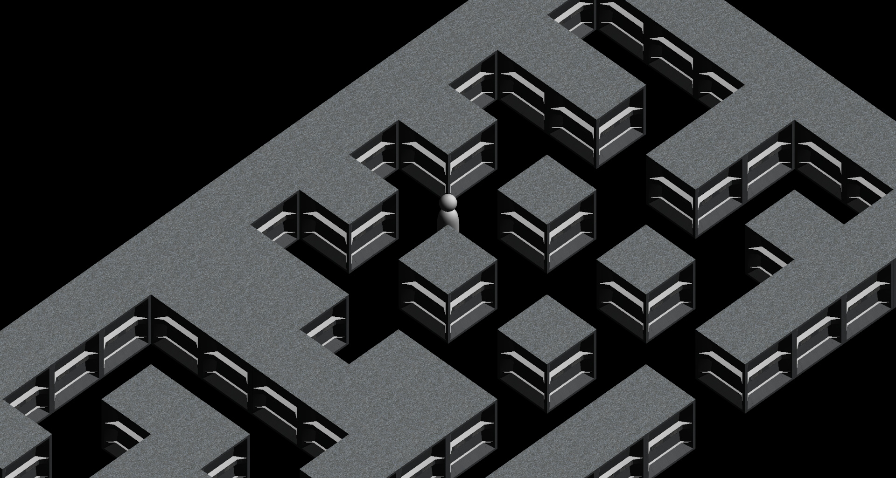

# Shadowclad

3D orthographic stealth game, and a purpose-built game engine



## The game

The player's objective is to find and get to the exit in each maze-like level, while avoiding contact with stationed and patrolling enemies. Player loses as soon as they are seen by an enemy, but they can't be spotted in the dark, they have a 'sonar'-like ability to see in the dark, and there is no fog of war. Player's character also doesn't make noise.

Levels are constructed out of a set of blocks, laid out according to a 2D image, where each pixel is 1 grid cell. Lamps providing light around the level can turn on and off periodically, in groups, often leaving some areas unlit. Changes in lighting are signalled early to the player, letting them take advantage of new dark spots.

Most of these features aren't implemented yet; this is an overview of current development goals.

## The engine

Shadowclad's engine is written in C99, using OpenGL, GLFW, GLEW, and Assimp. It includes custom implementations of geometric math, a rendering pipeline, a scene tree, an asset pipeline, input processing, logging, and performance monitoring.

Target platforms include Linux and Microsoft Windows on x86-64, although Windows builds are currently untested.

The render pipeline currently uses the legacy immediate mode OpenGL API, which will be replaced with a more modern (and performant) implementation at some point.

## Roadmap

[This project board](https://github.com/outfrost/shadowclad/projects/1) serves as the roadmap, and tracks all tasks and issues.

## Dependencies

To run and to compile, Shadowclad requires an x86-64 (amd64) system with:
* a C library released in the last 8 years
* OpenGL implementation supporting version 1.3 or later
* GLFW 3.x
* GLEW 2.x
* Assimp 4.x or 5.x

## Building

To build the project, you need make (preferably GNU make), and a C compiler with full support for C99.

1. Clone and enter the repository.
```sh
git clone https://github.com/outfrost/shadowclad.git
cd shadowclad/
```

2. Run `make` to build, or `make run` to build and run.

	This will put the compiled binary under the `target/<platform>/` directory, e.g. `target/x86_64-linux-gnu/shadowclad`.

To build with a particular compiler, set the `CC` environment variable, e.g.
```sh
CC=clang make run
```

To perform a clean build, run `make clean` before rebuilding.

### Assets
At runtime, Shadowclad loads assets from `assets/`, relative to the current working directory. For example, if you've built the Shadowclad binary at `target/x86_64-linux-gnu/shadowclad`, and you run it with
```sh
target/x86_64-linux-gnu/shadowclad
```
then it will load assets from `assets/` in the same parent directory as `target/`.

## Contributing

Issues and PRs are welcome, for all kinds of contributions. Changes accepted in PRs will be released under the license terms listed further below. When working on a time-consuming contribution, it's best to discuss it in issues first, to make sure it won't collide with something else.

## License

Copyright 2018-2020 Iwo 'Outfrost' Bujkiewicz

Except for assets explicitly noted below, this project is licensed
under the Mozilla Public License, version 2.0. See the LICENSE file
or http://mozilla.org/MPL/2.0/ for details.

The files:
* `assets/TexturesCom_MetalGalvanized0045_1_seamless_S.tga`
* `assets/wall01side.tga`

have been created with photographs from Textures.com. These photographs
may not be redistributed by default; please visit www.textures.com for
more information. These files are provided for personal use only, strictly
as part of Shadowclad as a complete game. Unless expressly permitted
otherwise by Textures.com, they must be removed from any derivative works.
